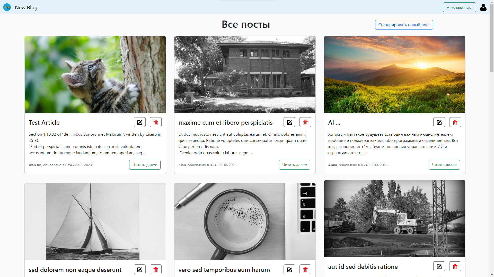

# New Blog

Данный сервис предназначен для ведения личного блога по любой теме.

На данный момент полностью реализован основной функционал CRUD. В ближайшем будущем планируется добавить авторизацию посредством выдачи JWT.



## Руководство по запуску

### 1. Установка всех зависимостей

```sh
npm install
```

### 2. Запуск Backend части

```sh
npm run start
```

### 3. Загрузка данных в БД MongoDB

При старте сервера создстся БД `new-blog`, а в ней коллекция `posts`. Затем можно загрузить в неё данные из json-файла `json/posts.json`

### 4. Запуск Frontend части

```sh
npm run dev
```

Данный проект выполнялся в качестве выпускной работы на курсе по FullStack разработке (2022-2023) в [МШП - Московской Школе Программистов](https://informatics.ru/) в рамках госпроекта «Код будущего»


<!-- ### Compile and Minify for Production

```sh
npm run build
``` -->
<!-- This project should help get you started developing with Vue 3 in Vite.

## Recommended IDE Setup

[VSCode](https://code.visualstudio.com/) + [Volar](https://marketplace.visualstudio.com/items?itemName=Vue.volar) (and disable Vetur) + [TypeScript Vue Plugin (Volar)](https://marketplace.visualstudio.com/items?itemName=Vue.vscode-typescript-vue-plugin).

## Customize configuration

See [Vite Configuration Reference](https://vitejs.dev/config/). -->
